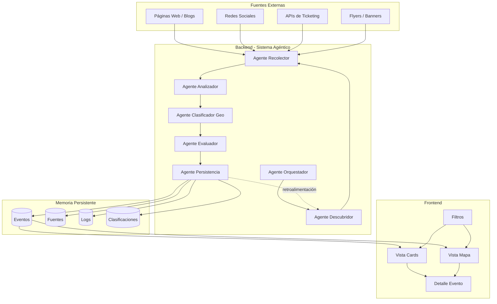
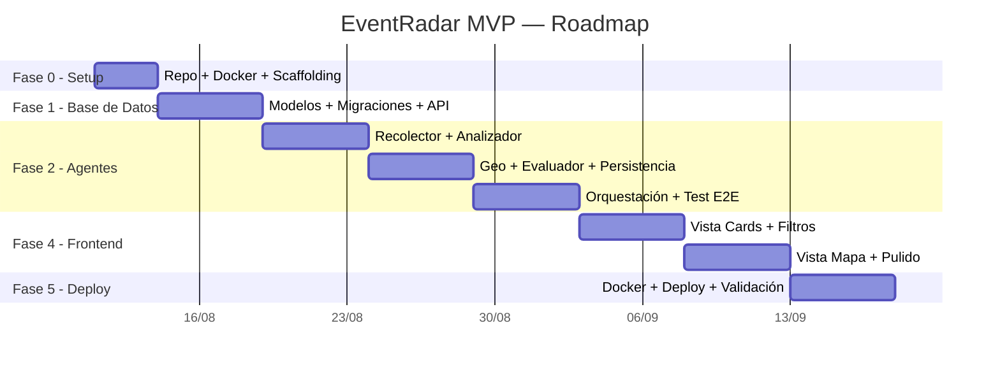

# 🚀 EventRadar — Plan Completo de Desarrollo MVP

**Sistema Inteligente de Centralización y Recomendación de Eventos Locales**
**Equipo:** Paulo Cabrera · Emiliano Dominguez
**Fecha:** Agosto 2026

---

## 1. Stack Tecnológico Recomendado

### 1.1 Backend

| Componente | Tecnología | Versión | Justificación |
|-----------|-----------|---------|---------------|
| **Lenguaje** | Python | 3.12+ | Ecosistema líder en IA/ML, scraping y NLP |
| **Framework API** | FastAPI | 0.115+ | Async nativo, validación automática con Pydantic, docs OpenAPI gratis |
| **ORM** | SQLAlchemy | 2.0+ | Maduro, potente, soporte async con `asyncpg` |
| **Migraciones** | Alembic | 1.13+ | Estándar de facto para SQLAlchemy |
| **Validación** | Pydantic | 2.0+ | Schemas tipados para modelos de entrada/salida |

### 1.2 Inteligencia Artificial

| Componente | Tecnología | Justificación |
|-----------|-----------|---------------|
| **LLM principal** | Google Gemini 2.0 Flash | Excelente relación costo/calidad, capacidad multimodal (texto + imagen), free tier generoso |
| **Framework de agentes** | LangGraph | Diseñado para orquestación agéntica con ciclos, estados y memoria — ideal para el ciclo Observar→Aprender |
| **LangChain** | Como capa de abstracción | Conectores a LLMs, prompts templates, parsers de salida |
| **OCR / Visión** | Gemini Vision (multimodal) | El mismo modelo analiza texto e imágenes de flyers, sin API separada |
| **Fallback NLP** | spaCy (es_core_news_lg) | NER local para extracción rápida sin costo de API |

### 1.3 Scraping y Recolección

| Componente | Tecnología | Justificación |
|-----------|-----------|---------------|
| **Scraping estático** | BeautifulSoup4 + httpx | Ligero, rápido, ideal para HTML estático |
| **Scraping dinámico** | Playwright | Renderiza JavaScript (Instagram embeds, SPAs) |
| **Rate limiting** | tenacity | Reintentos con backoff exponencial |
| **Respeto robots.txt** | robotexclusionrulesparser | Verificación automática antes de scrapear |

### 1.4 Base de Datos e Infraestructura

| Componente | Tecnología | Justificación |
|-----------|-----------|---------------|
| **Base de datos** | PostgreSQL 16 | Robusta, soporte geoespacial con PostGIS, JSON nativo |
| **Extensión geo** | PostGIS | Consultas geográficas nativas (distancia, radio) |
| **Cache / Queue** | Redis | Cola de tareas y caché de resultados de geocodificación |
| **Scheduler** | Celery + Redis | Tareas programadas robustas (ciclos lunes/viernes) |
| **Contenedores** | Docker + docker-compose | Entorno reproducible, deploy simplificado |

### 1.5 Geolocalización

| Componente | Tecnología | Justificación |
|-----------|-----------|---------------|
| **Geocodificación primaria** | Nominatim (OpenStreetMap) | Gratis, sin límite duro, buena cobertura en Argentina |
| **Fallback geocodificación** | Google Maps Geocoding API | Mayor precisión en zonas suburbanas, $200 USD/mes de crédito gratis |
| **Cálculo de distancias** | geopy (Haversine) | Cálculo de distancia punto a punto sin API |

### 1.6 Frontend

| Componente | Tecnología | Justificación |
|-----------|-----------|---------------|
| **Framework** | Next.js 15 (App Router) | SSR para SEO, React Server Components, routing moderno |
| **Estilos** | CSS Modules + variables CSS | Sin dependencia externa, control total del diseño |
| **Mapas** | Leaflet + React-Leaflet | 100% gratis, open source, tiles de OpenStreetMap |
| **Tipografía** | Inter (Google Fonts) | Moderna, legible, excelente para UI |
| **Iconos** | Lucide React | Consistentes, livianos |
| **HTTP Client** | Fetch nativo (Next.js) | Integrado con el framework |

### 1.7 Deploy

| Componente | Tecnología | Justificación |
|-----------|-----------|---------------|
| **Plataforma** | Railway | PostgreSQL + Redis managed, deploy desde GitHub, generous free tier |
| **CI/CD** | GitHub Actions | Tests automáticos, lint, deploy a Railway |
| **Monitoreo** | Sentry (free tier) | Tracking de errores en producción |

### 1.8 Costos Estimados Mensuales

| Servicio | Costo estimado |
|---------|:--------------:|
| Gemini API (Flash) | $0–5 USD |
| Railway (backend + DB + Redis) | $5–10 USD |
| Railway (frontend) | $0–5 USD |
| Google Maps Geocoding (fallback) | $0 (crédito gratis) |
| Sentry | $0 (free tier) |
| **Total estimado** | **$5–20 USD/mes** |

---

## 2. Arquitectura del Sistema

### 2.1 Diagrama de Alto Nivel



### 2.2 Estructura del Proyecto

```
eventradar/
├── backend/
│   ├── app/
│   │   ├── __init__.py
│   │   ├── main.py                    # FastAPI app + startup
│   │   ├── config.py                  # Settings con pydantic-settings
│   │   │
│   │   ├── models/                    # SQLAlchemy models
│   │   │   ├── __init__.py
│   │   │   ├── event.py               # Modelo Evento
│   │   │   ├── source.py              # Modelo Fuente
│   │   │   ├── execution_log.py       # Modelo Log de Ejecución
│   │   │   └── classification.py      # Modelo Historial Clasificación
│   │   │
│   │   ├── schemas/                   # Pydantic schemas (API I/O)
│   │   │   ├── __init__.py
│   │   │   ├── event.py
│   │   │   ├── source.py
│   │   │   └── cycle.py
│   │   │
│   │   ├── api/                       # Endpoints
│   │   │   ├── __init__.py
│   │   │   ├── router.py              # Router principal
│   │   │   ├── events.py              # GET /events, GET /events/{id}
│   │   │   ├── sources.py             # GET /sources (admin)
│   │   │   ├── admin.py               # POST /admin/run-cycle
│   │   │   └── health.py              # GET /health
│   │   │
│   │   ├── agents/                    # Los 7 agentes
│   │   │   ├── __init__.py
│   │   │   ├── base.py                # BaseAgent (clase abstracta)
│   │   │   ├── orchestrator.py        # Agente 1: Orquestador
│   │   │   ├── source_discoverer.py   # Agente 2: Descubridor
│   │   │   ├── scraper.py             # Agente 3: Recolector
│   │   │   ├── analyzer.py            # Agente 4: Analizador
│   │   │   ├── geo_classifier.py      # Agente 5: Clasificador Geo
│   │   │   ├── evaluator.py           # Agente 6: Evaluador
│   │   │   └── persistence.py         # Agente 7: Persistencia
│   │   │
│   │   ├── services/                  # Servicios compartidos
│   │   │   ├── __init__.py
│   │   │   ├── geocoding.py           # Nominatim + Google Maps fallback
│   │   │   ├── llm.py                 # Cliente Gemini (texto + visión)
│   │   │   └── scraping.py            # Utilidades de scraping
│   │   │
│   │   ├── db/
│   │   │   ├── __init__.py
│   │   │   ├── database.py            # Engine + SessionLocal
│   │   │   └── seed.py                # Carga de datos iniciales
│   │   │
│   │   └── tasks/
│   │       ├── __init__.py
│   │       └── scheduler.py           # Celery tasks + schedule
│   │
│   ├── alembic/                       # Migraciones
│   │   ├── versions/
│   │   └── env.py
│   ├── alembic.ini
│   ├── requirements.txt
│   ├── Dockerfile
│   └── tests/
│       ├── test_agents/
│       ├── test_api/
│       └── test_services/
│
├── frontend/
│   ├── src/
│   │   ├── app/
│   │   │   ├── layout.tsx             # Layout raíz
│   │   │   ├── page.tsx               # Home (lista de eventos)
│   │   │   ├── globals.css            # Design system
│   │   │   └── evento/[id]/
│   │   │       └── page.tsx           # Detalle de evento
│   │   │
│   │   ├── components/
│   │   │   ├── EventCard.tsx
│   │   │   ├── EventGrid.tsx
│   │   │   ├── EventMap.tsx
│   │   │   ├── EventDetail.tsx
│   │   │   ├── FilterBar.tsx
│   │   │   ├── SearchInput.tsx
│   │   │   ├── CategoryChips.tsx
│   │   │   ├── RadiusSlider.tsx
│   │   │   ├── ViewToggle.tsx
│   │   │   └── EmptyState.tsx
│   │   │
│   │   ├── lib/
│   │   │   ├── api.ts                 # Cliente API tipado
│   │   │   ├── types.ts               # TypeScript interfaces
│   │   │   └── utils.ts               # Helpers (formateo, distancia)
│   │   │
│   │   └── hooks/
│   │       ├── useEvents.ts
│   │       ├── useGeolocation.ts
│   │       └── useFilters.ts
│   │
│   ├── public/
│   │   └── icons/                     # Íconos por categoría
│   ├── package.json
│   ├── next.config.js
│   ├── tsconfig.json
│   └── Dockerfile
│
├── data/
│   ├── seed_events.json               # Eventos históricos iniciales
│   └── seed_sources.json              # Fuentes iniciales configuradas
│
├── docker-compose.yml                 # PostgreSQL + Redis + Backend + Frontend
├── .env.example
├── .github/
│   └── workflows/
│       └── ci.yml                     # Lint + Tests + Deploy
└── README.md
```

---

## 3. Modelos de Datos

### 3.1 Módulo 1: Eventos

```python
class Event(Base):
    __tablename__ = "events"

    id            = Column(String, primary_key=True)        # EVT-2026-0001
    nombre        = Column(String, nullable=False)
    lugar         = Column(String, nullable=False)          # Nombre del venue
    direccion     = Column(String, nullable=False)
    latitud       = Column(Float)
    longitud      = Column(Float)
    fecha         = Column(Date, nullable=False)
    hora_inicio   = Column(Time, nullable=True)
    precio        = Column(String, nullable=True)           # "Gratuito" / "$8.000"
    descripcion   = Column(Text, nullable=True)
    requisitos    = Column(String, nullable=True)
    categoria     = Column(Enum(CategoriaEvento), nullable=True)
    url_fuente    = Column(String, nullable=False)
    imagen_url    = Column(String, nullable=True)
    fecha_extraccion = Column(DateTime, default=func.now())
    puntaje_calidad  = Column(Float, default=0.0)           # 0.0 - 1.0
    estado        = Column(Enum(EstadoEvento), default="activo")
    id_fuente     = Column(String, ForeignKey("sources.id"))
    id_ejecucion  = Column(String, ForeignKey("execution_logs.id"))

class CategoriaEvento(enum.Enum):
    CONCIERTO = "concierto"
    FERIA = "feria"
    CINE = "cine"
    DEPORTE = "deporte"
    GASTRONOMIA = "gastronomia"
    MUNICIPAL = "municipal"
    TEATRO = "teatro"
    OTRO = "otro"

class EstadoEvento(enum.Enum):
    ACTIVO = "activo"
    ARCHIVADO = "archivado"
    ELIMINADO = "eliminado"
```

### 3.2 Módulo 2: Fuentes

```python
class Source(Base):
    __tablename__ = "sources"

    id                    = Column(String, primary_key=True)
    url_base              = Column(String, nullable=False, unique=True)
    nombre                = Column(String, nullable=False)
    tipo                  = Column(Enum(TipoFuente))
    indice_confiabilidad  = Column(Float, default=0.5)      # Arranca en 0.5
    total_extracciones    = Column(Integer, default=0)
    total_aceptados       = Column(Integer, default=0)
    total_rechazados      = Column(Integer, default=0)
    tasa_aceptacion       = Column(Float, default=0.0)
    ultima_revision       = Column(DateTime, nullable=True)
    activa                = Column(Boolean, default=True)
    notas                 = Column(Text, nullable=True)

class TipoFuente(enum.Enum):
    WEB_ESTATICA = "web_estatica"
    BLOG = "blog"
    RED_SOCIAL = "red_social"
    API = "api"
    PORTAL_NOTICIAS = "portal_noticias"
```

### 3.3 Módulo 3: Logs de Ejecución

```python
class ExecutionLog(Base):
    __tablename__ = "execution_logs"

    id                     = Column(String, primary_key=True)  # EXEC-2026-0001
    trigger                = Column(String)        # "programado_lunes" / "programado_viernes" / "manual"
    fecha_inicio           = Column(DateTime, nullable=False)
    fecha_fin              = Column(DateTime, nullable=True)
    fuentes_consultadas    = Column(ARRAY(String))
    eventos_detectados     = Column(Integer, default=0)
    eventos_geolocalizados = Column(Integer, default=0)
    eventos_aceptados      = Column(Integer, default=0)
    eventos_rechazados     = Column(Integer, default=0)
    eventos_duplicados     = Column(Integer, default=0)
    errores                = Column(JSON, default=[])
    duracion_seg           = Column(Float, nullable=True)
    estado                 = Column(String, default="en_curso")  # en_curso / completado / error
```

### 3.4 Módulo 4: Historial de Clasificaciones

```python
class ClassificationHistory(Base):
    __tablename__ = "classification_history"

    id                = Column(String, primary_key=True)
    id_ejecucion      = Column(String, ForeignKey("execution_logs.id"))
    id_fuente         = Column(String, ForeignKey("sources.id"))
    contenido_original = Column(Text)              # Texto o URL de imagen
    tipo_contenido    = Column(String)              # "texto" / "imagen"
    es_evento         = Column(Boolean)             # Clasificación del Analizador
    categoria_asignada = Column(String, nullable=True)
    confianza         = Column(Float)               # Score 0-1
    resultado_final   = Column(String)              # "aceptado" / "rechazado"
    motivo_rechazo    = Column(String, nullable=True)
    fecha             = Column(DateTime, default=func.now())
```

---

## 4. Detalle de los 7 Agentes

### Agente 1: Orquestador

```
Responsabilidad: Director central. Coordina la secuencia de ejecución.

Flujo:
  1. Crear registro en ExecutionLog (estado: en_curso)
  2. Llamar Agente Descubridor → obtener lista de fuentes priorizadas
  3. Para cada fuente:
     a. Llamar Agente Recolector → contenido bruto
     b. Llamar Agente Analizador → fichas de eventos candidatos
     c. Llamar Agente Clasificador Geo → eventos geolocalizados y filtrados
  4. Llamar Agente Evaluador → eventos validados (sin duplicados)
  5. Llamar Agente Persistencia → guardar en DB + actualizar fuentes + log
  6. Cerrar ExecutionLog (estado: completado)

Manejo de errores: Si un agente falla, loguear el error y continuar con los demás.
```

### Agente 2: Descubridor de Fuentes

```
Responsabilidad: Gestionar y priorizar las fuentes de información.

Entrada: Registro de Fuentes (tabla sources)
Salida: Lista ordenada de fuentes activas por indice_confiabilidad DESC

Lógica MVP:
  - Consultar fuentes donde activa = true
  - Ordenar por indice_confiabilidad descendente
  - Devolver la lista para procesamiento
```

### Agente 3: Recolector (Scraper)

```
Responsabilidad: Acceder a las fuentes y extraer contenido bruto.

Entrada: URL de la fuente
Salida: Lista de contenidos brutos (texto + imágenes + metadatos)

Lógica:
  1. Verificar robots.txt
  2. Si es web estática → httpx + BeautifulSoup
  3. Si requiere JS → Playwright (headless)
  4. Extraer: textos de publicaciones, URLs de imágenes, metadatos
  5. Registrar URL origen + timestamp por cada pieza
  6. Respetar rate limits (1-2 seg entre requests)
```

### Agente 4: Analizador (NLP + Visión)

```
Responsabilidad: Determinar si el contenido es un evento y extraer datos estructurados.

Entrada: Contenido bruto (texto o imagen)
Salida: Ficha estructurada del evento + score de confianza

Prompt Gemini (simplificado):
  """
  Analiza el siguiente contenido y determina si describe un evento futuro.
  Si es un evento, extrae los datos en formato JSON:
  {
    "es_evento": true/false,
    "confianza": 0.0-1.0,
    "nombre": "...",
    "lugar": "...",
    "direccion": "...",
    "fecha": "YYYY-MM-DD",
    "hora_inicio": "HH:MM",
    "precio": "...",
    "descripcion": "...",
    "categoria": "concierto|feria|cine|deporte|gastronomia|municipal|teatro|otro"
  }
  """

Para imágenes: Enviar al mismo modelo Gemini en modo multimodal.
```

### Agente 5: Clasificador Geográfico

```
Responsabilidad: Geolocalizar y filtrar por distancia.

Entrada: Ficha del evento (con dirección)
Salida: Ficha enriquecida con coordenadas, o descartada si está fuera del radio

Lógica:
  1. Geocodificar dirección → (lat, lon) via Nominatim
  2. Si falla → intentar con Google Maps Geocoding
  3. Calcular distancia Haversine entre evento y ubicación de referencia
  4. Si distancia > 150 km → descartar
  5. Asignar zona geográfica (ciudad/barrio)
  6. Devolver ficha enriquecida
```

### Agente 6: Evaluador

```
Responsabilidad: Control de calidad final.

Entrada: Lista de eventos candidatos geolocalizados
Salida: Lista de eventos aprobados + reporte de rechazos

Validaciones:
  1. Campos obligatorios: nombre ✓, fecha ✓, lugar ✓, url_fuente ✓
  2. Fecha en el futuro (y dentro del horizonte de 30 días)
  3. Detección de duplicados: fuzzy match en (nombre + fecha + lugar)
     - Usar SequenceMatcher o rapidfuzz con threshold ≥ 0.85
  4. Verificar URL fuente accesible (HTTP HEAD → status 200)
  5. Calcular puntaje de calidad:
     calidad = (completitud * 0.4) + (confianza_nlp * 0.3) + (confiabilidad_fuente * 0.3)
```

### Agente 7: Persistencia y Aprendizaje

```
Responsabilidad: Guardar eventos, actualizar métricas, cerrar ciclo.

Acciones:
  1. INSERT eventos aprobados en tabla events
  2. Registrar cada clasificación en classification_history
  3. Actualizar fuentes:
     - total_extracciones += contenidos procesados de esta fuente
     - total_aceptados += eventos aceptados de esta fuente
     - total_rechazados += eventos rechazados de esta fuente
     - tasa_aceptacion = total_aceptados / total_extracciones
     - indice_confiabilidad = tasa_aceptacion * 0.7 + factor_historico * 0.3
     - ultima_revision = now()
  4. Archivar eventos pasados (fecha < hoy → estado = "archivado")
  5. Actualizar ExecutionLog con métricas finales
```

---

## 5. API Endpoints

| Método | Ruta | Descripción | Params |
|--------|------|-------------|--------|
| `GET` | `/health` | Health check | — |
| `GET` | `/api/events` | Listar eventos activos | `?lat=&lon=&radio_km=&fecha_desde=&fecha_hasta=&categoria=&orden=fecha|distancia&page=&limit=` |
| `GET` | `/api/events/{id}` | Detalle de un evento | — |
| `GET` | `/api/categories` | Listar categorías disponibles | — |
| `GET` | `/api/sources` | Listar fuentes (admin) | — |
| `POST` | `/api/admin/run-cycle` | Ejecutar ciclo manualmente | `?trigger=manual` |
| `GET` | `/api/admin/logs` | Ver logs de ejecución | `?limit=10` |
| `GET` | `/api/admin/logs/{id}` | Detalle de un ciclo | — |

---

## 6. Plan de Desarrollo por Fases

### FASE 0 — Setup del Proyecto (3 días)

| Día | Tarea | Responsable |
|:---:|-------|:-----------:|
| 1 | Crear repo GitHub + estructura de carpetas | Paulo |
| 1 | `docker-compose.yml` con PostgreSQL 16 + Redis | Emiliano |
| 2 | Inicializar backend: FastAPI + Alembic + config | Paulo |
| 2 | Inicializar frontend: Next.js 15 + estructura | Emiliano |
| 3 | `.env.example`, `.gitignore`, CI básico | Ambos |
| 3 | Verificar: `docker-compose up` → `/health` = 200 | Ambos |

---

### FASE 1 — Base de Datos y API (5 días)

| Día | Tarea | Responsable |
|:---:|-------|:-----------:|
| 1-2 | Modelos SQLAlchemy (Event, Source, ExecutionLog, ClassificationHistory) | Paulo |
| 2 | Enums (CategoriaEvento, EstadoEvento, TipoFuente) | Paulo |
| 3 | Migraciones Alembic + extensión PostGIS | Emiliano |
| 3 | Script de seed: `seed_events.json` + `seed_sources.json` | Emiliano |
| 4 | Endpoints: `GET /events` con filtros (fecha, categoría, radio) | Paulo |
| 4 | Endpoints: `GET /events/{id}`, `GET /categories` | Paulo |
| 5 | Endpoints admin: `GET /sources`, `GET /admin/logs` | Emiliano |
| 5 | **Test:** la API devuelve eventos seed filtrados correctamente | Ambos |

---

### FASE 2 — Agentes Core (3 semanas)

#### Semana 1: Recolector + Analizador

| Día | Tarea | Responsable |
|:---:|-------|:-----------:|
| 1 | Clase abstracta `BaseAgent` con interfaz estándar | Paulo |
| 1-2 | Agente Recolector: scraping estático (httpx + BS4) | Paulo |
| 2-3 | Agente Recolector: scraping dinámico (Playwright) | Paulo |
| 3 | Agente Recolector: verificación robots.txt + rate limit | Paulo |
| 1-2 | Agente Analizador: prompts Gemini para discriminación evento/no-evento | Emiliano |
| 2-3 | Agente Analizador: extracción de entidades → JSON estructurado | Emiliano |
| 4 | Agente Analizador: análisis de imágenes (Gemini multimodal) | Emiliano |
| 4-5 | Agente Analizador: scoring de confianza + validación vs seed | Emiliano |
| 5 | Tests unitarios de ambos agentes | Ambos |

#### Semana 2: Geo + Evaluador + Persistencia

| Día | Tarea | Responsable |
|:---:|-------|:-----------:|
| 1 | Agente Clasificador Geo: integración Nominatim | Paulo |
| 1 | Agente Clasificador Geo: fallback Google Maps | Paulo |
| 2 | Agente Clasificador Geo: Haversine + filtro radio + zona | Paulo |
| 1-2 | Agente Evaluador: validación campos obligatorios | Emiliano |
| 2-3 | Agente Evaluador: detección duplicados (rapidfuzz) | Emiliano |
| 3 | Agente Evaluador: verificación URL + puntaje calidad | Emiliano |
| 4 | Agente Persistencia: INSERT eventos + log ejecución | Paulo |
| 4 | Agente Persistencia: actualizar índice confiabilidad fuentes | Paulo |
| 5 | Agente Persistencia: archivado automático + historial clasificaciones | Paulo |
| 5 | Agente Descubridor: CRUD fuentes + priorización | Emiliano |

#### Semana 3: Orquestación + E2E

| Día | Tarea | Responsable |
|:---:|-------|:-----------:|
| 1-2 | Agente Orquestador: coordina la secuencia completa | Paulo |
| 2-3 | Ciclo completo de 6 fases conectado end-to-end | Paulo |
| 3 | Manejo de errores resiliente (falla un agente → sigue) | Paulo |
| 1-2 | Configurar Celery + scheduler (lunes y viernes) | Emiliano |
| 2 | Endpoint `POST /admin/run-cycle` | Emiliano |
| 3-4 | **Test E2E:** ciclo real con ≥3 fuentes reales → eventos en DB | Ambos |
| 5 | Fix de bugs, ajuste de prompts, tuning de thresholds | Ambos |

---

### FASE 4 — Frontend (2 semanas)

#### Semana 1: Vista Cards + Filtros

| Día | Tarea | Responsable |
|:---:|-------|:-----------:|
| 1 | Design system: variables CSS (colores, tipografía, espaciado, sombras) | Paulo |
| 1 | Layout responsivo principal (header + filtros + contenido) | Paulo |
| 2 | `SearchInput` (ubicación con autodetección) + `RadiusSlider` | Emiliano |
| 2 | `CategoryChips` + `DateRangePicker` | Emiliano |
| 3 | `EventCard` (imagen, nombre, categoría, fecha, venue, distancia, precio) | Paulo |
| 3 | `EventGrid` (CSS Grid responsivo: 1-3 columnas) | Paulo |
| 4 | `EventDetail` (modal/panel con toda la info + link fuente) | Emiliano |
| 4 | Hook `useEvents` + conexión con API backend | Emiliano |
| 5 | Ordenamiento (temporal vs geográfico) + paginación | Ambos |

#### Semana 2: Vista Mapa + Pulido

| Día | Tarea | Responsable |
|:---:|-------|:-----------:|
| 1-2 | `EventMap` con Leaflet (pins por categoría, popup al clic) | Paulo |
| 2 | `ViewToggle` (Cards ↔ Mapa) con transición suave | Paulo |
| 1-2 | Estados vacíos, loading, error | Emiliano |
| 3 | Micro-animaciones (hover cards, aparición, loading skeleton) | Paulo |
| 3 | SEO: title tags, meta descriptions, OG tags | Emiliano |
| 4 | Test responsive (mobile, tablet, desktop) | Ambos |
| 5 | Accesibilidad: aria labels, contraste, navegación teclado | Ambos |

---

### FASE 5 — Deploy y Validación (5 días)

| Día | Tarea | Responsable |
|:---:|-------|:-----------:|
| 1 | Dockerfile backend (multi-stage) + Dockerfile frontend | Paulo |
| 1 | Configurar Railway: PostgreSQL + Redis + servicios | Emiliano |
| 2 | Deploy backend + frontend en Railway | Ambos |
| 2 | Configurar variables de entorno en producción | Ambos |
| 3 | Ejecutar primer ciclo real en producción | Ambos |
| 3 | Monitorear logs, verificar eventos persistidos | Ambos |
| 4 | Configurar Sentry para tracking de errores | Paulo |
| 4 | README completo (setup, arquitectura, contribución) | Emiliano |
| 5 | **Demo funcional** con datos reales | Ambos |

---

## 7. Roadmap Visual



**Duración total estimada: ~8 semanas** (trabajando en paralelo backend/frontend)

---

## 8. Riesgos y Mitigaciones

| Riesgo | Prob. | Impacto | Mitigación |
|--------|:-----:|:-------:|------------|
| Fuentes bloquean scraping | Media | Alto | Rotar user-agents, respetar rate limits, fuentes de respaldo |
| LLM clasifica mal al inicio | Alta | Medio | Threshold alto (≥0.8), validar contra seed, ajustar prompts |
| Costos API superan presupuesto | Baja | Alto | Gemini Flash es económico; cachear respuestas; monitorear uso |
| Fuentes cambian su HTML | Alta | Medio | Selectores resilientes, alertas cuando falla una fuente |
| Geocodificación imprecisa | Media | Bajo | Doble fallback (Nominatim → Google), caché de resultados |
| No llegar a la fecha límite | Media | Alto | Priorizar ciclo E2E funcional > features extras |

---

## 9. Primeros Pasos (Esta Semana)

```
☐  1. Crear repositorio en GitHub
☐  2. Definir la ciudad objetivo y listar 10-15 fuentes reales
☐  3. Verificar viabilidad de scraping de cada fuente (robots.txt, estructura)
☐  4. Obtener API key de Google Gemini
☐  5. Crear docker-compose.yml con PostgreSQL + Redis
☐  6. Preparar seed_events.json con ~20 eventos reales conocidos
☐  7. Preparar seed_sources.json con las fuentes verificadas
```

---

> [!TIP]
> **Consejo clave:** No intenten construir los 7 agentes perfectos de entrada. Hagan un ciclo completo end-to-end que funcione con 1 sola fuente y 1 evento, y después iterar. Un pipeline funcional vale más que 7 agentes incompletos.
